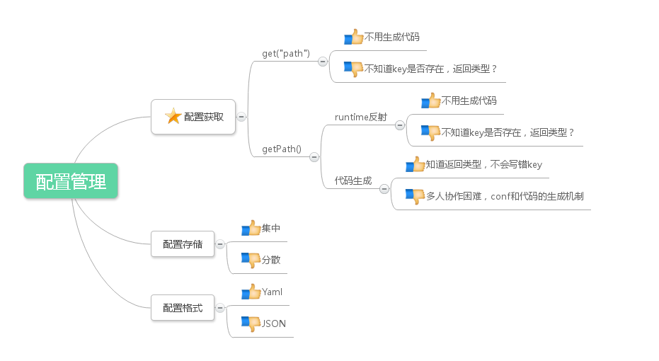

配置管理
====

目标
---
配置管理中心的目标是将我式的所有运维、业务相关的配置集中在一处进行管理。
这样做的好处主要有以下几点:
1. 集中配置,减少重复、冲突配置。
1. 简化多个环境,多套部署的配置管理。



原理
---


`cfg-center`类似于etcd、zookeeper之类的配置管理中心服务,主要区别如下:
1. 采用直白的yaml配置文件作为配置存储,方便现场部署时进行修改和debug。
1. 代码量少,超轻量级设计。
1. inotify关注配置修改,保证高性能。
1. RESTful请求接口,JSON响应格式,直白易操作。
1. 不依赖任何非必须系统库。

部署
---
部署目录结构如下:
```
├── bin                     # 主程序和运维脚本
│   ├── cfg-center
│   ├── restart.sh
│   ├── start.sh
│   └── stop.sh
├── conf_data               # cfg-center的配置数据
│   ├── ...(参见下面)
│   └── ...
└── log                     # 日志目录
    └── cfg-center.log
```

其中conf_data目录作为配置文件的唯一存储区域,目录结构如下
```
└── conf_data               # cfg-center的配置数据目录
    ├── aws.yaml            # 配置文件,Amazon环境                       
    ├── azure.yaml          # 配置文件,Azure环境            
    ├── test1.yaml          # 配置文件,test1环境     
    └── bank.yaml            # 配置文件,XX银行环境       
```

上述目录将会保存在git中,在开发&测试时直接用命令行工具、浏览器、Java/Python SDK请求即可。

yaml配置如下,后面有示例
```yaml
模块1:
    配置key: 配置value
    配置key: 配置value
    配置key: 配置value
模块2:
    配置key: 配置value
    配置key: 配置value
```

配置格式管理规范
--------
`cfg-center`启动后会采用conf_data目录的配置数据,使用默认端口:`2120`。

假设`conf_data/cmb.yaml`的内容如下:
```yaml
dummyWorkder:
    slotStatement: select * from A

task-manager:
    serverPort: 9876
    dbURL: "jdbc:mariadb://localhost:3306/TM"
    dbUser: root
```

我们想要获取`cmb`环境的`task-manager`的`dbURL`配置,
那么请求 `http://cfg-center:port/conf/cmb/task-manager/dbURL`
将会得到HTTP响应:
```json
"jdbc:mariadb://localhost:3306/TM"
```

请求`http://cfg-center:port/conf/cmb/task-manager`
将会得到HTTP响应:
```json
{
    acquireIncrement: 1,
    dbPassword: "1qaz",
    dbURL: "jdbc:mariadb://localhost:3306/TM",
    dbUser: "root",
    maxPoolSize: 10,
    minPoolSize: 2,
    serverPort: 9876
}
```

所以获取配置就是要访问如下URL:
`http://cfg-center:port/conf/{环境}/{模块}/{yaml中的key}`

测试环境
----
* 线上测试环境: http://172.27.0.100:2120/conf
* 配置文件托管repo: http://git.4paradigm.com/prophet/global-config (与master分支保持实时更新)

SDK调用
-----
除了RESTful API调用,也将会提供Java、Python的SDK。(待开发)

Feature如下:
* 程序启动时通过args参数传入环境信息和cfg-center地址,如:`-env=cmb -cfgcenter=cfg.4paradigm.com`
* 允许使用本地`-debugconf=xxx.yaml`override配置中心配置, **仅供研发自测使用,线上部署会删除所有本地配置**
* 模块名在初始化配置管理实例时传入,例如:`Conf conf = new Conf("dummyWorkder");`
* 配置获取API示例:`getInt("maxPoolSize")`, `getString("dbPassword")`


CLI调用
-----
提供命令行工具查询配置,方便开发和部署。

Feature如下:
* 支持tab推导
* 支持维护`/etc/hosts`文件,方便部署(详细feature待补充)

打包调用方式
------
所有环境相关的配置,包括但不限于下述,都会存储在配置git repo中,并由cfg-center提供实时读取服务:
* 私有部署的hosts信息
* DB连接串、密码
* Hadoop、Spark地址

后续会有自动化工具,根据配置生成各种部署包。架构大致如下:


